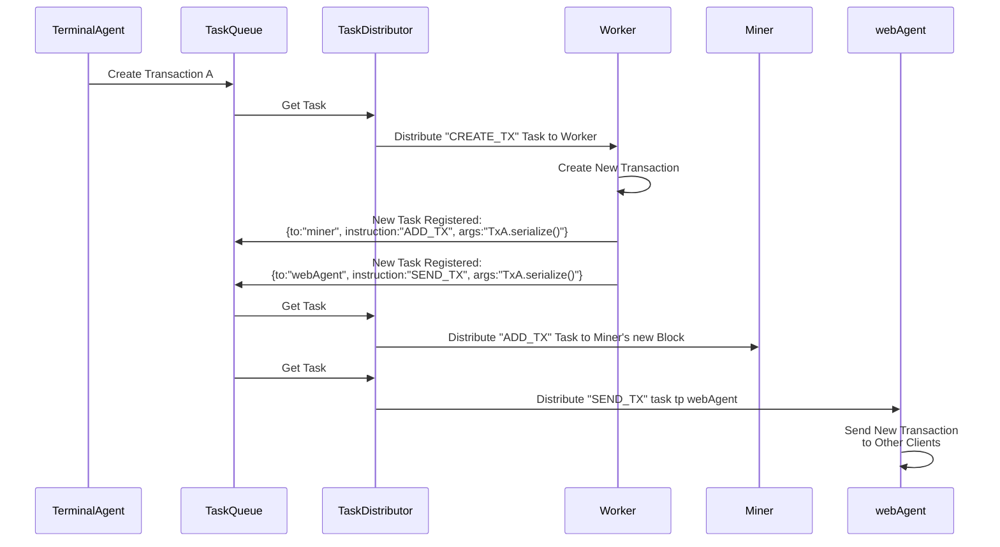
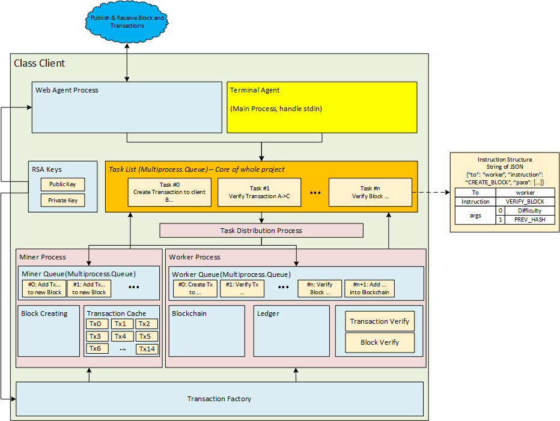

# GZFLS Blockchain Project


`product` store the previous version of project.

`buildVersion` is the current version of project we are working on

`test` will have some fancy implementation that we may add into project in the future.


## Program Sequence Diagram

### Process to Create A New Transaction



## Client Structure

Since the client need to get instruction from `webAgent` and `TerminalAgent` at the same time and the `input()` method of Python will clog the main process, we decided to use a multi-process structure to build the client.

There are three main parts of the client:

`Collector` - Collect tasks from outer environment (`webAgent` and `TerminalAgent`)

`Distributor` - Get Task from the Main Task Queue and distribute the task to corresponding worker. `TaskDistributor`

`Worker` - process that do the actual work including mining, transaction verification, new transaction creation etc. (`miner` and `worker`, since miner needs to calculate the hash value for most of the time and we don't want the whole working process being clogged, we put most of the light-calculation work to `worker` while heavy-calculation work to `miner`).



Each worker has its own task queue. The tasks are serialized into the JSON form as example below

```json
{
    "To": "miner",
    "Instruction": "CREATE_BLOCK",
    "args": [
        <Transaction Tx0 ...>,
        <Transaction Tx1 ...>,
        ...
        <Transaction Tx15 ...>,
        currentDifficulty
    ]
}
```