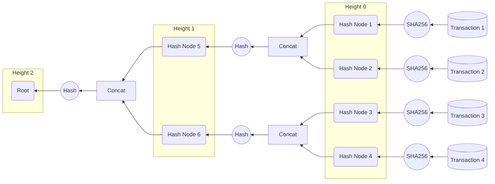

# Block Class

### 1.1 Brief Intro

this project we need to write the block class of the blockchain. The project is based on the last project. In this project we need to write `block.py`

### 1.2The Property Intro

This part introduce the property your `Block` class should include
|      Property      |   Type   | Meaning                                                      |
| :----------------: | :------: | ------------------------------------------------------------ |
| `Merkle_Tree_Root` | `String` | the Merkle_Tree_Root of the transactions,you need to use funcation`Make_tree()`to generate it from the given transactions |
|  `pre_block_hash`  |  `int`   | the previous block hash                                      |
|      `nounce`      |  `int`   | the `nounce` value of the block                              |
|    `timestamp`     | `float`  | the timestamp of the block you can get this by using time module |
|      `index`       |  `int`   | the index (or the height) of the block in the blockchain     |

###  1.3 The Method Intro

your `Block`class must include the following methods:

|   Function Name   |                     Function Description                     |
| :---------------: | :----------------------------------------------------------: |
|   `__init__()`    | this is the constructor of your `Block`class, you need to initialize the Property mention in the part 1.2 |
|     `hash()`      | you need to include the properties(***pre_block_hash***, ***nounce***,and ***timestamp***)to a str and hash it by using ==<u>[sha256](https://en.bitcoinwiki.org/wiki/SHA-256#:~:text=SHA-256%20is%20a%20member%20of%20the%20SHA-2%20cryptographic,the%20NSA.%20SHA%20stands%20for%20Secure%20Hash%20Algorithm.)</u>==. you need to return the hash of the block which is an Integer, you may need to use some function in `hashlib` module which will introduce in part 1.4 |
| `get_tree_root()` | given a list of transactions, you need to return the Merkle_tree root of this transactions,you may use the function `merge()` |
|     `merge()`     | given a list of hash you need to merge their by pair  until there is only one hash |

### 1.4 Notes

there are some function you can use went programming the `Block`class

#### `time`

you can use the funcation`time.time()`to get the time. notise,  it return the time in a format of float you need to convert it to `String` by using `str()`when writing the `hash()`function

#### `hashlib`

you can use function`hashlib.sha256()`to get the hash of an object, but it is in a format of Hash Object you need to use`hexdigist()`to make the result a hex and you need to convert it to Integer when wrting`hash()`

```python
import hashlib
hashlib.sha256(a).hexdigest()
```

### 1.5 Merkle Tree
##### get_tree_root()

in this function you need to convert every  transaction to their hash and used a list to contain them. Then you will need to used `merge()`to merge each hash together and finally get the tree root

##### merge()

you need to combine each hash together by pair until their is one .

All the steps are as following:

---




