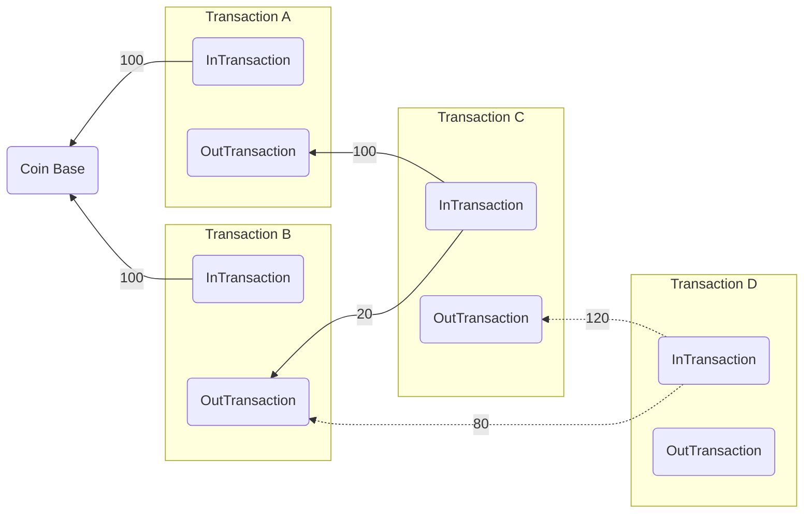

# Blockchain - Project 1. Transaction and Ledger Class

## 1.0 Brief Intro

In the last project, we have finished the RSA encryption / decryption functions in file `RSA_func.py`. This project is **based on the result of Project 0** as we need to create the signature of `Transaction object`. Before we start I will introduce the basic structure of `Transaction` and `Ledger`.

## 1.1 Class Transaction

A Transaction class has several properties and methods. The properties are listed below:

| Property Name    | Property Data Type | Property Meaning                                             |
| ---------------- | ------------------ | ------------------------------------------------------------ |
| `tx_time`        | `int`              | This property represent the time that a transaction object is created (unit - ms). **You should NOT modify this property**. |
| `randID`         | `int`              | If we only use `tx_time` as Transaction ID, two transactions created at the same time will have same Transaction ID, so we introduce `randID` to create a Unique ID for each transaction Object. **You should NOT modify this property** |
| `isCoinBase`     | `boolean`          | If a transaction is from the COINBASE, this property will be set as '`true`', otherwise, this property will be '`false`' |
| `inTransaction`  | `list`             | **CORE PROPERTY OF TRANSACTION OBJECT**, a list contains a set of **tuples** with elements `(Txn, Index, Signature)`, detailed explanation is written below. |
| `outTransaction` | `list`             | **CORE PROPERTY OF TRANSACTION OBJECT**, a list contains a set of **lists** with elements `(Amount, ReciverPubKey, isUsed)`, detailed explanation is written below. |

Among all these properties, the properties you need to modify and pay attention to are `isCoinBase`, `inTransaction`, and `outTransaction`.

### How `inTransaction` and `outTransaction` work?

A transaction object's core properties have a structure like this:

```
=================================================================================
|   isCoinBase  |       inTransaction         |       outTransaction            |
|---------------+-----------------------------+---------------------------------|
|               |  Txn  |  index  | Signature | Amount | ReciverPubKey | isUsed |
|               |-------+---------+-----------+--------+---------------+--------|
|     False     |1233456|    0    | (tokens)  |   50   |  (pubKey, n)  | False  |
|               |1233457|    2    | (tokens)  |   50   |  (pubKey, n)  | False  |
|               |1233458|    0    | (tokens)  |        |               |        |
=================================================================================
```

An `inTransaction` property is a list that contains multiple tuples with two integers and a signature that represent an entry from the output from another transaction. The entries stored in `inTransaction` represent where the money in this Transaction is from. The `Txn`, or the first element in each tuple is the Transaction ID of the last transaction. The `index` points to the entry in `outTransaction` in the last transaction.

An `outTransaction` property is a list that contains multiple tuples with three integers that represent an entry in the output of transaction.



<div style="text-align: center;">Fig 1. Example Case for Transaction Formation</div>

Suppose we want to add a new transaction, *Transaction D* that transact 140 coins someone into the ledger, and the money in `Transaction D` comes from `C` and `B` (dashed line). Here's the thing that will happen:

1. The transaction initiator will sign a signature on the Transaction ID of Transaction B and C

2. The `inTransaction` in Transaction D has two entries - the `(Txn_of_Transaction_B, index_B, signature_B)` and `(Txn_of_Transaction_C, index_C, signature_C)`.

3. Now, in Transaction D, we have 200 units of input, but we only want to give others 140 units. What we will do is to transact 60 of 200 units back to transaction initiator as the 'charge'.

   ```mermaid
   graph LR;
   subgraph Transaction D
   D_in(InTransaction)
   D_out(OutTransaction)
   end
   
   Rec(Coin Receiver)
   Owner(Transaction Creator)
   
   P(prev_Transactions) --120 + 80 = 200--> D_in
   D_out --140--> Rec
   D_out --60--> Owner
   ```

   <div style="text-align: center;">Fig 2. Example of Charge and Balance of Transaction</div>

4. Therefore, we put two entries to `outTransaction` property in Transaction D, (suppose Coin Receiver's `pubKey` is `0001` and the Coin Receiver's `pubKey` is `0002`). The `outTransaction` now contains `(140, 0002, False)` and `(60, 0001, False)`.

Each transaction has a unique ID, which is equivalent to `

## 1.2 Class Ledger

class `Ledger` inherited from class `dict` in python. Therefore, it support ALL the operations on dictionary like `.keys()`, `.update(...)` and `Ledger[key]`.

By design, the Ledger should have Transaction ID as the key and actual Transaction object as value. When we want to add a transaction into the ledger, we will use the function `Ledger.addTransaction(self, Transaction)` and validation will be performed before transaction is added.

## 1.3 Notes

### 1.3.0 Use Proper Functions when Sign / Decrypt Signature

Since the hash of a transaction object is **much bigger than the $n$ we selected for RSA key**, you ***SHOULD NOT***  use the `encryption` and `decryption` function in `RSA_func.py`.

You ***SHOULD***  use the encapsulated `encryptObject(object, privateKey)` and `decryptObject(signature, pubKey)`. These functions can split the input object to a tuple of tokens to encrypt and then merge the decryption result to get original object.

### 1.3.1 Raise Exceptions when Failure Detected

To further help you implement this project, we specially design several exception classes to show different problems when processing transaction.

The Exception Classes are stored in `Transaction_exceptions.py`.

When the transaction has some problem (e.g. if the input and output is not balance, use `raise TransactionNotBalanceError()`), raise corresponding exceptions.

All exceptions provided are showed below

| Exception Class                 | Exception Description                                        |
| ------------------------------- | ------------------------------------------------------------ |
| `TransactionNotBalanceError()`  | The transaction is not balance since the input amount and output amount are different in a transaction |
| `TransactionDoubleSpendError()` | Some of the `inTransactions ` in the new transaction points to an entry in `outTransactions` that has `isUsed` value of `true`. Therefore, a double spend is detected and `TransactionDoubleSpendError` should be raised. |
| `TransactionInNotExist()`       | Some of the `inTransaction` in new transaction point to a transaction that is not recorded in the Ledger. |
| `TransactionSignatureError()`   | The decryption result of some signature(s) in `inTransaction` does NOT equal to the expected result. |

## 1.4 Project Requirement

In this project, you will implement the following functions to create a Transaction and Ledger system.

| Function Name                                                | Function Description                                         |
| ------------------------------------------------------------ | ------------------------------------------------------------ |
| **Helper Functions**<br />These two functions' implementation is relatively easy and are not close combined with other part of the project, so it is recommended to implement them first. |                                                              |
| `Transaction.py/signSignature(...)`                          | Given a transaction object and the private key, return the signature of the hash of given transaction object. |
| `Ledger.py/decryptSignature(...)`                            | Given a signature and the public key, return the decryption result. |
| **Transaction.py**<br />The Transactions class is CLOSELY RELATED to the Ledger class. However, since Ledger is inherited from dictionary, you can suppose the given ledger object is just a dictionary using Transaction ID as Key and Transaction object as value. |                                                              |
| `class Transaction.__init__(...)`                            | This Transaction will produce a new Transaction Object       |
| `class Transaction.addInputTransaction(...)`                 | This is a helper function that add a new entry into the `Transaction.inTransaction` property. (You can NOT implement this function, we won't test this separately) |
| `class Transaction.addOutputTransaction(...)`                | This is a helper function that add a new entry into the `Transaction.outTransaction` property (You can NOT implement this function, we won't test this separately) |
| `getMyTransaction(...)`                                      | Given a Ledger object and specific Public Key, the function will return a list of transactions that transact to this Public Key. |
| **Ledger.py**<br />While the main part in Transaction.py is to create a transaction object, the main task in Ledger.py is to create a function that can verify given transaction and decide whether or not adding this new Transaction into the ledger. |                                                              |
| `class Ledger.addTransaction(...)`                           | Given a new Transaction, validate the transaction first, if the transaction is valid, change the state of `isUsed` in corresponding entries of `outTransaction` from `false` to `true`, and at last add the transaction into Ledger Object. |
| `class Ledger.checkIsBalance(...)`                           | Given a new Transaction, check whether the transaction is balance. That is, whether the sum of input transactions equal to the sum of output transactions. |
| `class Ledger.checkIsUnused(...)`                            | Given a new Transaction, check whether all the input transactions are Unused. |
| `class Ledger.checkInSig(...)`                               | Given a new Transaction, check whether all the signatures in input transactions are valid.<br />That is, check whether the decryption result of all signatures are equal to the hash of corresponding transaction. |
| `class Ledger.checkRecursiveTx(...)`                         | Given a new Transaction, use three check functions above to see whether the transaction is valid in an recursive way until the COINBASE is met. (We will trust any transaction from COINBASE without any condition) |

## 1.5 AutoGrader.py

In this project, we use a specially designed `autograder` to test your implementation. It will give feedback based on the exception find on your implementation. Run `autograder.py` directly to test your files.

If your implementation is correct, the output will be like this

```bash
Autograder Start @ 2020-12-24 09:50:14.499625
V 1.0.0 By Mark
If you have any problem with Autograder, ask on the WeChat group directly
--------------------------
Test Case 1. Create Ledger and RSA_keys to setup test environment
[Pass]  | Ledger is created.
[Pass]  | RSA Keys Created.
[Pass]  | Ledger.getBalanceStat() Function returns a dictionary.

Test Case 2. Creating Simple Transactions between Users
[Pass]  | Transaction from COINBASE is accepted.
[Pass]  | Basic Transaction between Peoples are processed correctly.

[Pass]  | Ledger detect the modified Transaction and raise TransactionNotBalanceError as expected.
[Pass]  | Ledger detect the signature created by A is invalid and raise TransactionSignatureError as expected.
[Pass]  | Ledger detect that the input transaction of the new transaction is invalid and raise TransactionInNotExist as expected.


Congratulation! You passed All the tests with 0 Warning and 0 Error.
```

If the output is not something like this, follow the instruction & exceptions raised by the `autograder` and improve your implementation.

This is what will happen when you run the `autograder` without any implementation.

```bash
Autograder Start @ 2020-12-24 09:50:14.499625
V 1.0.0 By Mark
If you have any problem with Autograder, ask on the WeChat group directly
--------------------------
Test Case 1. Create Ledger and RSA_keys to setup test environment
[Pass]  | Ledger is created.
[Pass]  | RSA Keys Created.
[Warn]  | Ledger.getBalanceStat() function does NOT return a dictionary, instead, it returns an object with type <class 'NoneType'>. Since we need this function for test cases below, the cases below may raise Exceptions due to this.
Autograder will continue to run.

Test Case 2. Creating Simple Transactions between Users
[Warn]  | Some (All) of the Transactions from COINBASE failed to add into the ledger. This may be caused by improper validation in Ledger.addTransaction.
Autograder will continue to run.
[Fatal] | The valid transactions between people are blocked by the ledger. Autograder Terminated.
Detailed Exceptions is raised.
Traceback (most recent call last):
  File ".../Transaction/AutoGrader.py", line 102, in <module>
    raise e
  File ".../Transaction/AutoGrader.py", line 97, in <module>
    assert len(set(test_Ledger.getBalanceStat().values()) - {40, 60, 30, 70, 50}) == 0
AttributeError: 'NoneType' object has no attribute 'values'
```

Good Luck and Happy Coding!